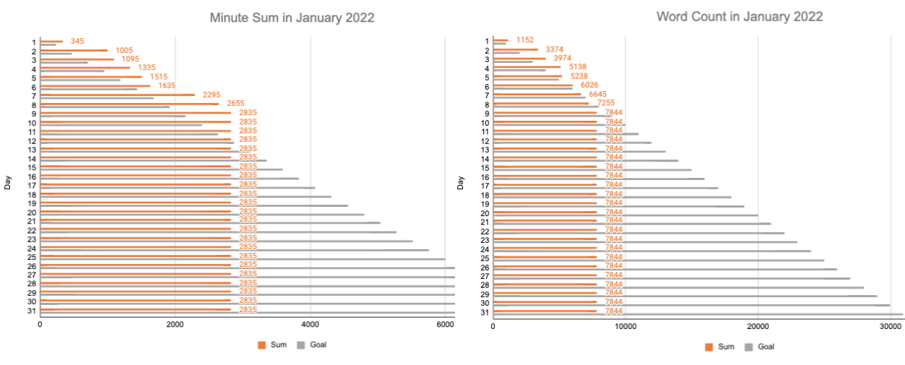
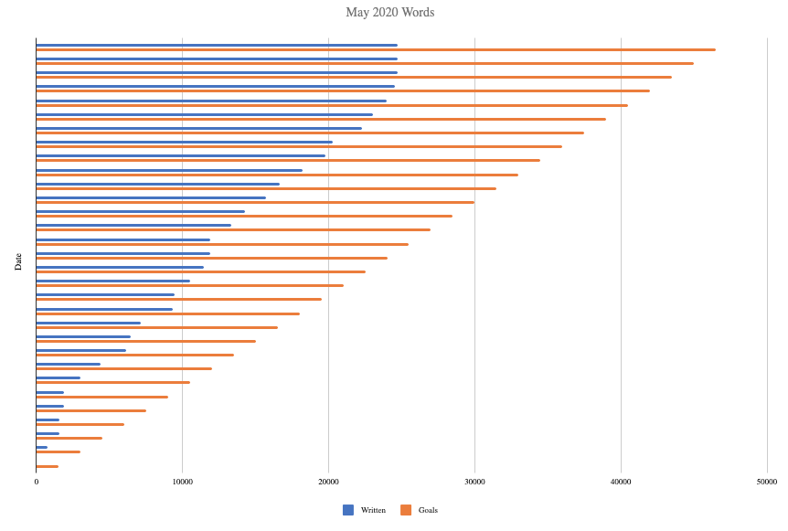
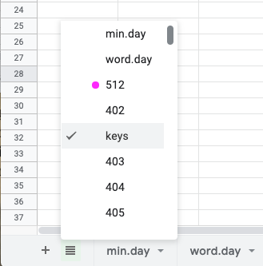
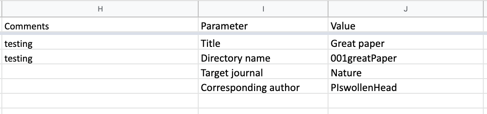
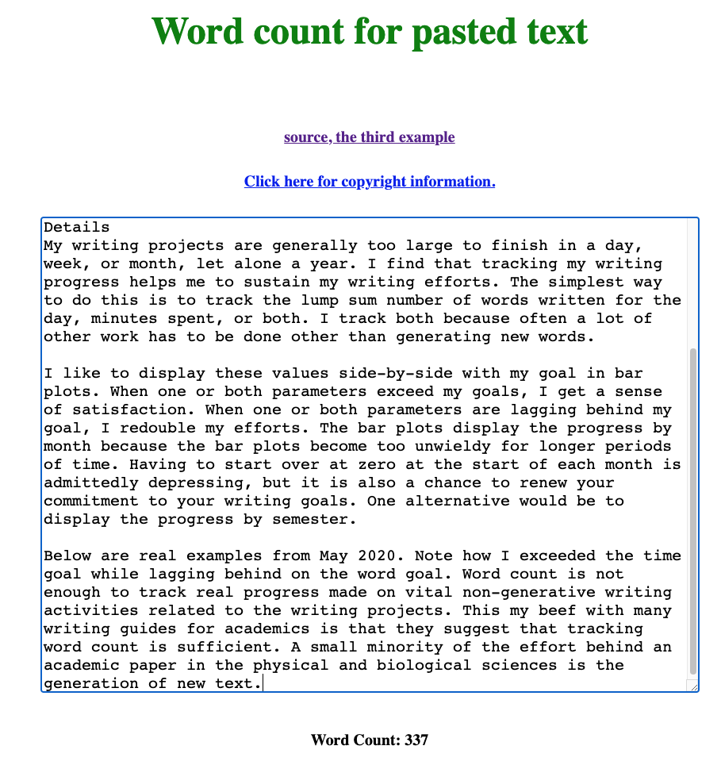

[](https://opensource.org/licenses/MIT)

# Workbook to track progress on writing projects with bar plots

## Synopsis
The attached Open Office Document (WritingProgress2023tenProjectsTest.ods) can be imported into Google Sheets, where it was created. 
You can also open this document in Libre Office or Open Office for offline use. 
The Excel version WritingProgress2023tenProjectsTest.xlsx can be run in Microsoft Excel.

After spending 20-60 minutes customizing the workbook for your current and planned writing projects, you should be set for tracking your writing progress for 2023. 
It should take no more than a minute a day to make the entries and to check on your monthly progress displayed as bar plots, as shown below. 


<p align="center"></p>

## The problem being addressed here

Academics have to complete many writing projects during the course of a year.
Most academics do not have the luxury of working on only one writing project per day.
Many have to make progress on two or more projects per day.
The management of multiple writing projects is the largest unsolved problem academic writing and time management.
No one has a universal answer.
Most books on academic writing actually skip over this gnarly issue.
The above a workbook is tool that can be used to address this problem.
Like any tool, you can use it well or poorly.

## Disclaimer

The above tool tracks your effort.
It does not optimize the prioritization of your writing projects, although it can inform that optimization.

The above tool will not make you write a lot.
You can only do that by setting up a writing schedule and sticking with it.
See [the writer's creed](https://github.com/MooersLab/thewriterslaw) for some guidelines on making and following a schedule.


## What is a writing project?

Simple: Any writing task that cannot be completed in one sitting.

### Examples of writing projects:

1. Research papers
2. Grant applications
3. Grant progress reports
4. Grant reviews
5. Some meeting abstracts
6. Some manuscript reviews
7. Annual progress report for department chair
8. Handbooks for lab members
9. Book chapters
10. Books
11. Lecture notes
12. Promotion dossier
13. Software documentation
14. Some laboratory protocols

### Unlikely a writing project

1. Reviews of meeting abstracts
2. Most e-mails 

### Why only ten writing projects in the above workbook?

Most academics work on more than ten writing projects in a year.
However, manually updating the blank sheets in the above workbook at the start of each new year is time-consuming and tedious.
New project sheets can be added by duplicating an existing project sheet and renaming it. 


## Details

My writing projects are generally too large to finish in a day, week, or month, let alone a year. 
I find that tracking my writing progress helps me to sustain my writing efforts. 
The simplest way to do this is to track the lump sum number of words written for the day, minutes spent, or both.

I track both because often, a lot of other work has to be done on wriring projects other than just generating new words. 
I display these values side-by-side with my goal in bar plots. 
When one or both parameters exceed my goals, I get a sense of satisfaction. 
When one or both parameters are lagging behind my goal, I redouble my efforts. 
The bar plots display the progress by month because the bar plots become too unwieldy for longer periods of time. 
Having to start over at zero at the start of each month is admittedly depressing, but it is also a chance to renew your commitment to your writing goals. 
One alternative would be to display the progress by semester.
I will leave that to others to code up.

Below are real examples from May 2020 during the first spring of our unending COVID pandemic. 
Note how I exceeded the time goal while lagging behind on the word goal. 
Word count is not enough to track real progress made on vital non-generative writing activities related to the writing project. 
Word counts fail to capture the effort expended on the following kinds of effort that advance a writing project: 

- data analysis
- figure preparation
- communicating with collaborators by e-mail or in person
- rewriting and editing
- literature review

My beef with many writing guides for academics is that they suggest that tracking word count is sufficient. 
This might be true for very senior scientists for who have an army of junoir scientists doing their yeoman work.
But, this is not true for the vast majority of professors in the harder sciences. 


<p align="center"></p>

<p align="center"></p>

I created a workbook of spreadsheets in Google Sheets to do the above progress tracking. 
This workbook started out as an Excel workbook about six or seven years ago. 
I fondly recalled a period when I used it daily for several months, and I made some real progress. 
I moved it to Google Sheets four years ago and made a massive revision to the layout to include the tracking of time spent because it was not enough to track words written. 
I store this workbook on my Google Drive. 
I add a link to this workbook to the top row of my private homepage, so I can reach this workbook with the click of a link.
You can alternatively add the link to your browser's tool bar for immediate access.
You could do likewise for the Excel workbook stored on your harddrive.

You can also make a bash alias to open the workbook in a browser by entering the alias name on the command line. 
For example, I open my writing progress workbook in Google Chrome by entering **wpc**. 
I have similar aliases for other browsers like ***wps*** for use with Safari and ***wpf*** for use with Firefox. 
Here is an example of the bash code that can be customized and added to your ***.bashrc*** or ***.zshrc*** file:

```bash
alias openc="open -a Google\ Chrome.app"
alias wpc='openc https://docs.google.com/spreadsheets/d/<insert workbook specific code>'
```

I created a worksheet for each writing project, whose name starts with a project number, hence the numbers in the tabs of the workbook. 
I enter the number of words written and time spent on a given day in the sheet for a specific project. 
There is a column for comments where I might describe my accomplishments or problems. 
Filling in the comment column is optional. 
The tracking of accomplishments should really be done in a writing log for the specific project. 
(See  [Writing Log template in LaTeX](https://github.com/MooersLab/writingLogTemplate) or [Writing Log template in Org-mode](https://github.com/MooersLab/writingLogTemplateInOrg)).
The use of one sheet per project allows me to get sums of either parameter by selecting the appropriate range in a column. 
The sum and other statistics are displayed in the lower right-hand corner of the workbook.

Please note that there is a column for notes.
I am not using it. 
Ignore it for now. 

The daily entries from each project are automatically summed and stored in the `min.day' and `word.day' sheets. 
The cumulative sums are automatically displayed by month in the horizontal bar plots along the right margin of the `min.day' and `word.day'  sheets. 
The cumulative sums are shown side-by-side with my goal for each day: 240 minutes and 1000 words.
These goals are set at the limit of what more professional writers accomplish in a day.
Adjust these daily goals to suit your need.

I selected 240 minutes because this is the maximum amount of time that professional writers spend per day generating new text. 
Of course, you can spend 720 minutes in a day on the writing-related tasks of figure making or data analysis. 
You can also make steady progress with as little as 20 minutes a day, especially if you have only one writing project.

I selected 1000 words per day as a goal because higher goals like 2000 words per day drove me to write too much text, most of which I will never publish. 
As a result of this excess writing, I was spending less time on the important non-generative writing-related tasks like making figures, editing the text, reading-related papers, data analysis, and the many other activities that advance a writing project. 
The average academic paper is 5000 words, so I should be able to finish one paper a week:  I wish. 
This would be possible if I had a lab with 50 workers. 

You can adjust these daily goals by editing the appropriate columns in the min.day and word.day sheets. 
500 words and 120 minutes per day may be more realistic goals for beginners; it depends on what works for you. 
The right values are the ones that help your sustain your productivity. 
That is all that matters.

The workbook is set up for 2023. 
I will try to remember to make a new workbook for 2024. 
Otherwise, the 2023 notebook can be extended to 2024 and beyond if you want to track your effort on projects that span several years. 
You can duplicate rows 1-366 and edit them appropriately. Alternatively, you can make a copy of a blank version of this workbook and edit it for a fresh start at the beginning of 2024.

I have included only ten projects in this demo workbook so that it is not overwhelming. 
To customize the workbook with project names, you have to relabel the project sheets and column day in the min.day and word.day sheets. 
The cell formulas in the min.day and word.day sheets will update automatically with changes in the sheet name.

To add more writing projects, duplicate a sheet and rename it. 
Then add a column for that project in the min.day and word.day sheets and insert the corresponding cell formulas in this column in both sheets. See the formulas in the existing columns for guidance. 
The parameter values for the plots do not have to be adjusted.

Most advanced academics have one to several dozen active and quiescent writing projects in the form of grant applications, research papers, review articles, seminars, books, and so on. 
The presence of ten or more project sheets hinders finding the correct sheet to enter the daily progress by just looking at the names of the sheets along the bottom of the workbook.
To around this limitation, click on the four horizontal bar icon in the lower lefthand corner. 
This will open a scroll menu that you can use to quickly select the appropriate project. 
See the image below. 
I recommend this approach when the number of tabs becomes too large for all of them to be seen at once.

<p align="center"></p>

To cope with the problem of finding the correct project, you can also zoom out on the workbook to shrink the size of the tabs at the bottom of the workbook so that more tabs are displayed. 
You can also color code the tabs by the category of the writing project.

I use a project indexing scheme that is mapped to the project's directory in the home folder on my computer and to the writing project in the Overleaf web service.
I sometimes forget what the project number and name represents. This is a common problem when working on related writing projects in parallel. 
To refresh your memory, you can read the parameters and values fields to the right of the comments field in a project's sheet to enter the project's metadata like title, directory name, and so on. 
See the example below:

<p align="center"></p>

The project indices are clustered by project type, which also aids in finding the correct sheet quickly. 
For example, manuscripts start with index 001, and grant applications start with index 1001. 
You can change the order of the tabs; this action will not impact the sums in the `words.day' and `min.day' sheets or the generation of the bar plots.

The keys to sustaining the use of this workbook are (1) to make it rapidly accessible via a link or alias and (2) to ease the finding of the specific writing project sheet in which to enter the number of words written, minutes spent, or both.
The latter problem can be addressed by using a color code for the active writing projects.
I shortened the writing project sheet name to the project's index number, and I now rely on the metadata in the sheet to check that I have opened the correct sheet. 
I usually have the project number at the front of my mind when working on a writing project, but metadata in the sheet are a good sanity check. 
Enter the ***end*** key of an extended keyboard to move to the end of a row to display the monthly plots along the right margin of the ***min.day***  and ***word.day*** sheets.  

I have removed the other barrier to using the workbook, which is the coding of the monthly bar plots. 
This task can be tedious and has deterred me from using the workbook in the past when I was using Excel to edit the workbook offline. 
I had trouble recalling how to edit the data ranges at the start of each month. 
Fear of expending effort on this task set up a motivation barrier. 
I have since found that the setting up of the plots is easier in Google Sheets than in Excel. I also find it to be more efficient to do the plot setups all at once for the entire year.

## Word count of day's writing

One problem that I ran into was getting word counts for the selected text that I had just written for a specific writing project. 
You can get the word count of everything in 750words.com or in an entire document on Overleaf but not of specific text selection. 
On Overleaf, you have to remember to get the word count at the start and end of a writing session to get the net number of new words added.

A simpler and faster solution is to paste the freshly written text into a text area of a webpage that returns the word count. 
I paste the selected text into the text area of the above wordCount.html file, and it reports the word count. 
I stored this HTML file with my private homepage (index3.html) on my hard drive. 
I made a link to wordCount.html from my index3.html file. 
In a few seconds, I can click on that link and paste from my clipboard a text selection into the text area of this page and get back the word count. 
The result of doing so with an earlier version of the first three paragraphs of this README.md file is shown below.


<p align="center"></p>

Reload the webpage to clear the textarea of the old text and prepare it for new text.
One advantage of the text area is that typos can be detected if you have grammar and spellchecker extensions added to your browser.

Another solution is to use the [GhostText extension](https://www.youtube.com/watch?v=2NPUDYAOgW0&t=3s) for the web browser and use your favorite powerful text editor (VSC, Emacs, Vim, NeoVim, SublimeText) to get the word count of the selected text.


# Daily protocol for adding progress to a project in the writingProgress2023

Below is the daily protocol for adding minutes spent and words written to the WritingProgress2022 Google Workbook.
The essential steps will become second nature with practice, but having a written protocol nearby can save time.

Several optional steps may not apply to your situation.
Amend the protocol to suit your workflow.
I strongly recommend using the writing log to keep track of your accomplishments and planned actions. 
See  [Writing Log template in LaTeX](https://github.com/MooersLab/writingLogTemplate) or [Writing Log template in Org-mode](https://github.com/MooersLab/writingLogTemplateInOrg).

The goal is to practive the steps of the protocol until they are automatic.
The protocol is useful for getting back on the bandwagon after you fall off.


1. Fetch word count and minutes spent and jot down on a scrap of paper
2. Open the WritingProgress2023.
3. Navigate to the project sheet via the sheet scroll menu in the lower left.
4. Enter your day's data in the Minutes and Words columns.
5.  **[optional]** Add a brief comment about your accomplishments.
6.  Navigate to min.day and check for the presence of **#REF!** in the daily total. This error means that a cell formula in the min.day sheet may be absent or miscoded. The errant cell will also display **#REF!**. Fix the code by checking cells above or below for the formula format (e.g., `=('tab name'!F2)` ). 
7.  Check the bar plot.
8.  Repeat the above two steps with  word.day. The correct formula is ***=('tab name'!G2)***.
9.  **[optional]** Update your writing.log for the project. See  [Writing Log template in LaTeX](https://github.com/MooersLab/writingLogTemplate) or [Writing Log template in Org-mode](https://github.com/MooersLab/writingLogTemplateInOrg).
10. **[optional]** Run `git pull' on the writing project from the appropriate folder if you are using Overleaf. Having a current copy available locally when you lack an internet connection is useful.


# Advice for when you fall behind

Stuff happens (e.g., progress reports, lecture preparation, seminars, travel, meetings, e-mail, lab work, illness, unexpected visitors, burnout, and so on), and you may fall behind on your word count goal for the month. 
If the difference is more than 1000 words, you will have trouble catching up in a single day.
It is hard to recover from a writing marathon where you generate 5000-7000 words in one day.
Instead, divide the difference by the number of remaining days in a month.
Add the quotient to your daily goal.
An updated daily goal of under 2000 is sustainable for a week or two.
Take care to avoid burnout by pushing too hard.

# Protocol for adding a new project to writingProgress2023

These steps become routine when adding a batch of writing projects to WritingProgressWorkbook during the initial setup.
However, it is easy to overlook a step later because of the many steps involved.
Modify the protocol to suit your workflow.

Using hyperlinks to the writing project can reduce time spent searching for a writing project. 
I added the link to the top of my private homepage, the parameter section of the individual sheets in the WritingProgress workbook, and the document used to inventory my writing projects. 
The latter may be redundant, but it is useful when you have many writing projects.
I also added links to related writing projects near the top of the writing log and the parameter section of a project sheet in the WritingProgress workbook.

1. Assign project number, a tentative title, and directory name in a Google Sheet or whatever you use to inventory your writing projects.
2. Copy a similar Overleaf project and rename it.
3. Customize the writing.log by rewriting the rationale for the project.
4. Add links to related project to writing.log. See  [Writing Log template in LaTeX](https://github.com/MooersLab/writingLogTemplate) or [Writing Log template in Org-mode](https://github.com/MooersLab/writingLogTemplateInOrg).
5. Change the title of the AnnotatedBibliography. Delete the old entries in annote.bib.
6. Customize the manuscript document by changing the title.
7.  **[optional]** Draft a rationale for the project at the top of the writing log. See  [Writing Log template in LaTeX](https://github.com/MooersLab/writingLogTemplate) or [Writing Log template in Org-mode](https://github.com/MooersLab/writingLogTemplateInOrg).
8.  **[optional]** Draft a two-paragraph Introduction for the manuscript. Build it around a central hypothesis (or objective for a methods paper). I follow the formula for Introductions laid out by David Lindsay in the book "Scientific Writing = Thinking in Words".
9. **[optional]** Draft the Abstract.
10. **[optional]** Draft a list of alternate titles (avoid colons, limit to one line)
11. **[optional]** Draft a list of keywords
12. Paste the above newly generated text into wordCount.html.
13. Add the project to your progress tracker: writingProgress2023.
         
       1. Duplicate a project sheet and rename it with the project number.
       2. Customize the parameters for the sheet: Title, directory name,  link to the Overleaf project, links to related overleaf projects. 
       3. Add Overleaf links to related projects
       4. Add columns to min.day and words.day sheets.
       5. Add the codes to the min.day and word.day cells. The first uses column F, and the second uses column G.
       6. Add your word count and minutes from the above writing.
       7. Check that the daily sums are working.
       8. Check that the plots are functioning.

14. Add project directory on your local hard drive.
15. Run the [setupManuscript script](https://github.com/MooersLab/setup-manuscript/blob/main/README.md) to create the subfolders that you typically use in a manuscript project.
16.  **[optional]** Clone the Overleaf project with git to the project's local directory.
17.  **[optional]** Add project as a new calendar to Google Calendar. 
18.  **[optional]** Add link to Overleaf project to your private homepage.
19.  **[optional]** Update the writing.log with your accomplishments.
20.  **[optional]** Update the list of planned actions.
21.  **[optional]** Update gCal using the new calendar.

After several hundred calendars have accummulated, Google Calendar becomes very slow.
I migrated to using a Google Sheet and project IDs to track my time in April 2022.
I am still using this approach as of January 2023.

The above optional steps that involve generating text will customize the project.
This customization will help to distinguish one project from related writing projects.
This customization is critical when you draft several similar writing projects in parallel because it reduces the likelihood of duplicating a writing project during the early stages of their development.


# Protocol for updating the workbook for the new year (20-30 minutes)

This protocol can be used to carry forward the project column labels but not the record of progress.
See the protocol below to also do the latter.

1. Open the workbook in Google Sheets.
2. Under File, duplicate the workbook and rename it in the process.
3. Select min.day sheet.
4. Change the year in cells A2:A366 (A2:A367 for leap years).
5. Update the day of the week in Column D.
6. Delete the values in the cells H2 to X366, where X is the rightmost column with minute data. Delete the columns for archived projects.
7. Update the year in the titles of the bar plots next to the right margin by clicking on each title and editing it.
8. Select the word.day sheet and repeat steps 3-7.
9. Select the first project and repeat steps 4 and 5 and delete any values in columns F, G, and H.

**You are now ready for the new year!!!!**


# Protocol for appending the next year.

The following protocol will conserve your investment as you move into the new year.
You can extend the cells by another 365 rows.


1. Select min.day sheet.
2. Change the year in cells A368:A732.
3. Extend the day of the week in Column D.
4. Copy the plots month by month. Edit their titles.
5. Edit the data ranges for each plot. Take care to select the correct data ranges.
6. Update the year in the titles of the bar plots next to the right margin by clicking on each title and editing it.
7. Select the word.day sheet and repeat steps 2-6.
8. Select the first project and repeat steps 2 and 3.


# Related links

- [The writer's creed](https://github.com/MooersLab/thewriterslaw)
- [Writing Log template in LaTeX](https://github.com/MooersLab/writingLogTemplate). LaTeX beginers can use this document easily on Overleaf without any configuration.
- [Writing Log template in Org-mode](https://github.com/MooersLab/writingLogTemplateInOrg) Org-mode is a powerful analog of markdown that can interpret LaTeX code blocks. It is vastly superior to markdown. It is best edited in Emacs (Sorry, Oveleaf cannot yet work with Org-mode), but VS Code has some support for org-mode files.
- [Emacsconf 2022 talk about GhostText on YouTube, December 2022](https://www.youtube.com/watch?v=2NPUDYAOgW0&t=3s) Includes demostration of using Emacs to edit a document in Overleaf.
